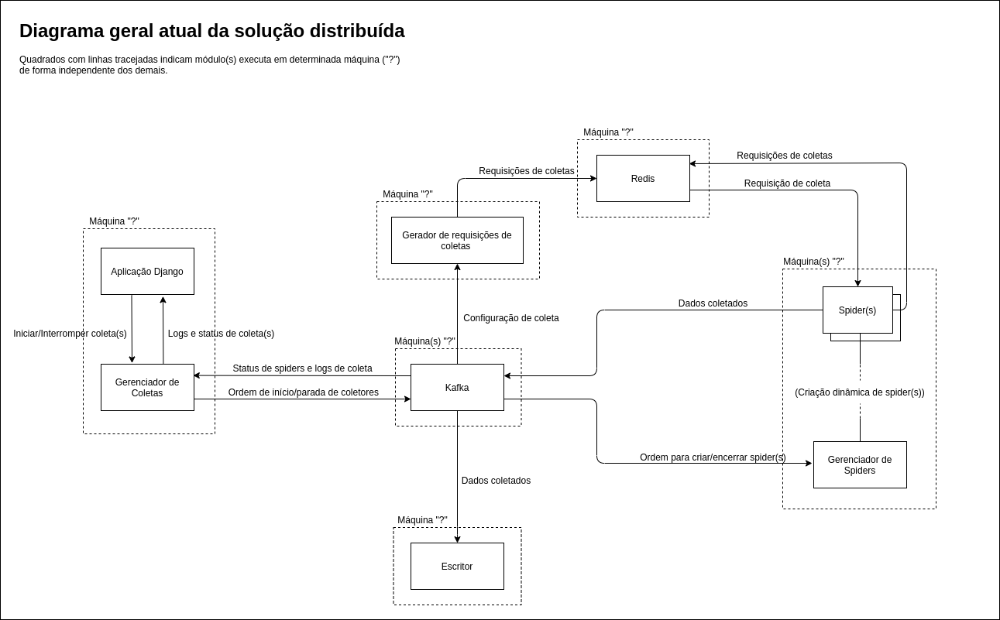

# C01

Desenvolvimento de ferramentas para construção e manutenção de coletores de páginas da Web. (Em desenvolvimento)

## TODO

- [x] Atualização da interface para gerir os spiders distribuídos
- [x] Suporte a templated URLs
- [ ] Testes em máquinas diferentes
- [x] Suporte a páginas dinâmicas
- [ ] Iniciação automática dos serviços

## Arquitetura atual da solução distribuída

 

O sistema possui 4 módulos principais:

- **Gerenciador de coletas** (`crawler_manager`)
    - Módulo acoplado ao servidor. 

    - É responsável por realizar a interface entre a aplicação Django e os módulos de processamento de coletas.

    - Recebe status de spiders (criação e encerramento) vindos de gerenciador de spiders. Com isso, é capaz de saber e informar ao servidor quando uma coleta terminou.

    - Também repassa os logs das coletas ao servidor, bem como o atualiza sobre o andamento das coletas, em geral.

- **Gerador de requisições de coletas** (`link_generator`)
    - Responsável por gerar as requisições iniciais de coletas. 

    - Útil para o caso de URLs parametrizadas não sobrecarreguem o servidor.

    - **Funcionamento atual**

        - O módulo recebe a configuração de um coletor e gera todas requisições de coletas possíveis. Um dos possíveis impactos disso é "inundar" o Redis.

    - **Funcionamento desejado/futuro**
        
        - Geração requisições de coletas sob demanda. 

- **Gerenciador de spiders** (`spider_manager`)
    - Responsável por gerenciar o ciclo de vida dos spiders, bem como informar ao gerenciador de coletas sobre o status dos mesmos e das coletas.

    - **Funcionamento atual**

        - Há suporte há apenas um spider por coleta para cada gerenciador de spiders. Mas podem haver múltiplos spiders gerenciados, desde que sejam de coletas diferentes.

        - Spiders são criados no início do processo de coleta, e, caso um spider fique ocioso por determinado tempo, ele é automaticamente encerrado.

    - **Funcionamento desejado/futuro**

        - Suporte a múltiplos spiders de um mesmo coletor.

        - Balanceamento de carga. Criação e encerramento de spiders a qualquer momento, de acordo com a necessidade. 

- **Escritor** (`writer`)
    - Responsável por persistir as coletas, bem como baixar e salvar os possíveis arquivos encontrados nela.

    - **Funcionamento atual**

        - Só é suportado que apenas um deste módulo execute ao mesmo tempo. Pois os dados coletados são salvos diretamente no sistema de arquivo da máquina hospedeira.

        - Mais de um deste módulo em execução implicaria em dados salvos em máquinas diferentes ou possíveis conflitos de arquivos.

        - Isso reflete em um possível gargalo ao salvar os dados coletados, como os dados coletados são transmitidos por um único tópico Kafka e o processamento por um única instância deste módulo.

    - **Funcionamento desejado/futuro**

        - Suporte a sistema de arquivos distribuídos e/ou salvamento dos dados coletados em banco de dados (para o caso das páginas), possibilitando múltiplas instâncias do módulo executando ao mesmo tempo.