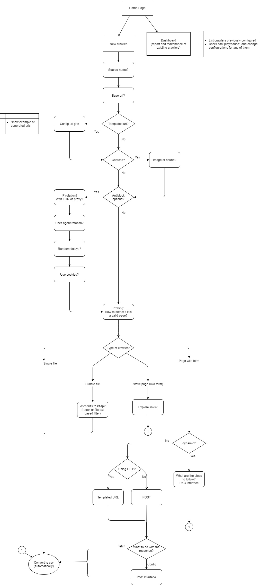

# C04

Desenvolvimento de ferramentas para construção e manutenção de coletores de páginas da Web. (Em desenvolvimento)

Existem 4 tipos de coletores bases, que podem ser personalizados através da interface feita em django:
1. Coletor de páginas estáticas
2. Coletor de páginas dinâmicas ou onde é necessário interagir com formulários.
3. Coletor para coleta de arquivos
4. Coletor para coleta de conjunto de arquivos

Os coletores são desenvolvidos em Scrapy em conjunto com Puppeteer para o caso de páginas dinâmicas. O gerenciamento dos coletores é feito com o Scrapy-cluster.

Dentre as funcionalidades disponíveis para os coletores, temos:
- Mecanismos para camuflagem dos coletores, como rotação de endereço de IP e gerenciamento de cookies.
- Mecanismos para tentar contornar Captchas e outras formas de bloqueio
- Ferramentas para gerar endereços automaticamente através de templates
- Ferramentas para extração e conversão de dados

Os coletores também podem ser gerenciados através de uma API RESTful.

## Instalação

Para usar o programa é necessário um _virtualenv_ ou uma máquina apenas com **Python 3.7+**, de maneira que os comandos _"python"_ referencie o Python 3.7+, e _"pip"_ procure a instalação de pacotes também do Python 3.7+.

Alguns serviços necessitam que o Java esteja rodando no sistema, o mesmo pode ser instalado por 
```
sudo apt install default-jre  
```

Para instalar todos os programas e suas dependencias execute o script install.py.
```
python install.py
```

Se deseja instalar apenas algum dos módulos implementados como o módulo de extração de parâmetros de formulários, navegue até a pasta do módulo e execute pip install:
```
cd src/form-parser
pip install .
```

## Execução

Para execução da interface basta executar o seguinte comando:
```
python run.py
```

E então basta acessar _http://localhost:8000/_

Se quiser acessar o programa através da rede, execute:
```
python run.py 0.0.0.0:8000
```
E então use o IP da máquina onde a interface está sendo executada para acessá-la. Por exemplo, se a máquina onde você rodou o comando acima tem endereço de IP _1.2.3.4_, e esse endereço é visível para sua máquina através da rede, você pode acessar _http://1.2.3.4:8000/_.

## Fluxo de interação com a interface

